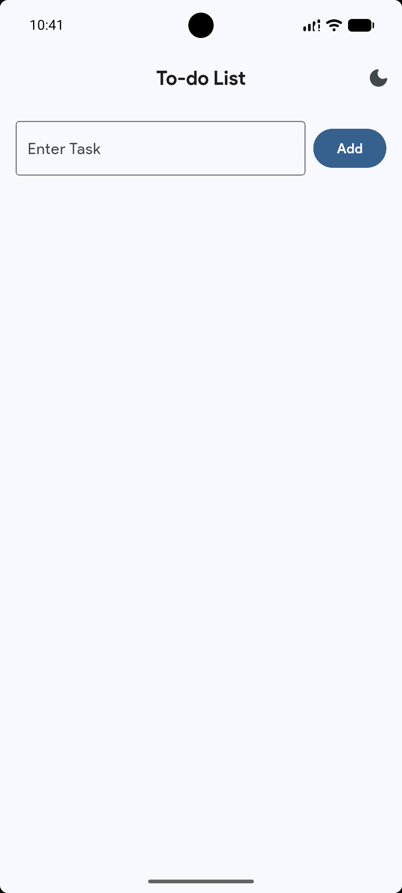
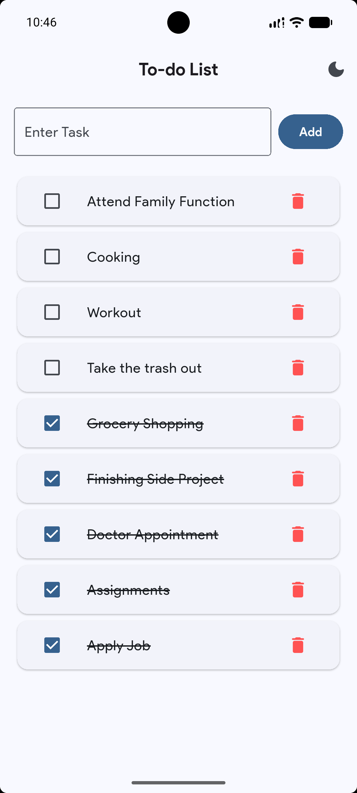
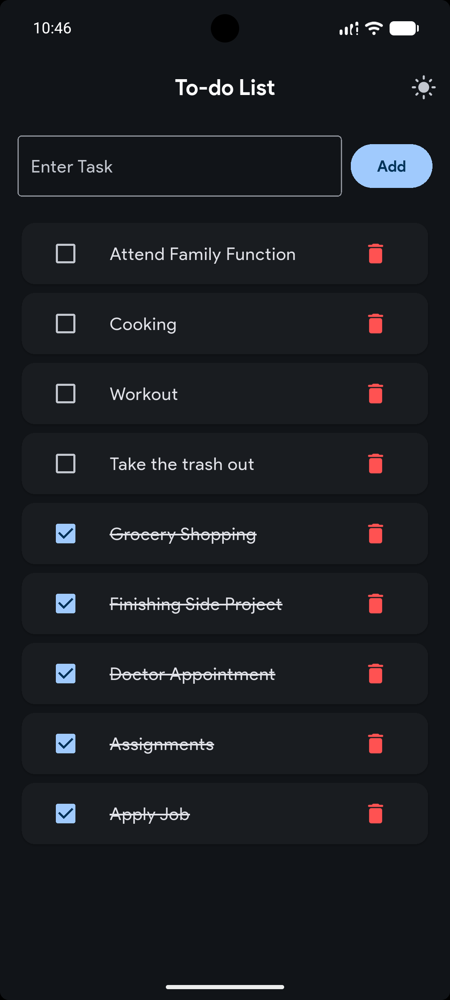

# 📝 simpleTodo

A robust and persistent Todo application built with **Flutter**. This project leverages the **Provider** pattern for reactive state management and **Shared Preferences** for local data storage, ensuring a seamless user experience across app sessions.

## 🚀 Features

* **Persistent Storage:** Tasks are saved locally using `shared_preferences`, so your data survives app restarts.
* **Reactive State Management:** Uses `Provider` to handle data flow and UI updates efficiently.
* **CRUD Operations:** Full support for adding, viewing, marking as done, and deleting tasks.
* **Modern UI:** A clean, Material Design interface with smooth animations.
* **Efficient Performance:** Minimal rebuilds thanks to the Provider-Consumer pattern.

## 🛠️ Tech Stack

* **Framework:** [Flutter](https://flutter.dev/)
* **State Management:** [Provider](https://pub.dev/packages/provider)
* **Local Storage:** [Shared Preferences](https://pub.dev/packages/shared_preferences)
* **Language:** [Dart](https://dart.dev/)

---

## 💾 Data Persistence Logic

The app uses a "Service-Provider" approach to handle data:

1. **Serialization:** Todo objects are converted to JSON strings using `Map` structures.
2. **Storage:** The JSON string list is saved to the device's disk via `SharedPreferences.getInstance()`.
3. **Hydration:** On app launch, the `TodoProvider` fetches the stored strings, decodes them back into objects, and notifies the UI listeners to display the tasks.

---

## 📂 Project Structure

```text
lib/
├── models/         # Task models with toJson/fromJson methods
├── providers/      # TodoProvider (Logic + SharedPreferences integration)
├── screens/        # Home and Task Detail screens
├── widgets/        # Reusable components like TaskTile
└── main.dart       # App entry point & Provider initialization
```

## 📸 Screenshots

| Home Screen | Light Mode | Dark Mode |
| :---: | :---: | :---: |
|  |  |  |
